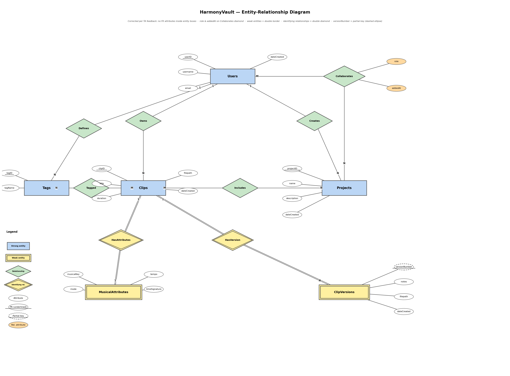

# HarmonyVault — Final Report

**Course**: CSDS 341 Introduction to Database Systems, Spring 2026
**Team**: Jacob Liebson (jel212), Sky Zhou (sxz903), Alfred Chen (qxc225)
**Submission**: single zip to Canvas, 2026-05-01 23:59

---

## 1. Application Background

### 1.1 The problem

Musicians accumulate short audio clips — half-finished melodies, chord progressions, drum loops, vocal takes — dozens per week for an active writer. Once the clips leave the DAW they live as opaque files on disk: `Voice Memo 2024-03-08 1.m4a`, `project_v12_bounce_final_FINAL.wav`, and so on. The metadata that *matters* musically (key, tempo, mode, time signature, mood, and which project the idea belongs to) is not written down anywhere the filesystem can search. Six months later, when the musician needs "that minor-key 72 BPM idea I had last spring," the ordinary filesystem is useless.

### 1.2 Why a relational database

The workload is exactly what relational systems are good at:

- **Data volume.** A single artist can produce thousands of clips per year. Real catalogs (e.g. the 232,000-track Kaggle Spotify dataset we use as seed data) easily exceed 10⁵ rows and require indexed retrieval.
- **Complex selection.** "All minor-key clips between 90 and 120 BPM tagged `cinematic` that appear in at least one shared project" is a natural multi-way join that a relational engine answers in milliseconds.
- **Integrity.** Foreign-key constraints and CHECK constraints keep the catalog self-consistent even when edited from multiple clients. A filesystem offers no such guarantees.
- **Collaboration.** Multiple users sharing a project need transactional semantics that filesystem sync cannot supply.

### 1.3 Existing solutions and how HarmonyVault differs

| Tool | What it offers | What it lacks relative to HarmonyVault |
| --- | --- | --- |
| **Splice** | Cloud loop marketplace with key/BPM search and DAW integration | User does not own the catalog; cannot store or share private clips; no relational access for custom queries |
| **Loopcloud** | Local caching client over a vendor loop library | Same vendor-lock-in problem as Splice; no project / collaboration model for the user's own clips |
| **Ableton Live Browser / NI Maschine** | In-DAW sample organization with tagging and preview | Tied to one workstation and one DAW; cannot be queried outside the host; no shareable project model |
| **iTunes / Apple Music** | Indexed library with playlists | Built around finished tracks; no per-clip musical attributes, no versioning, no collaboration |

HarmonyVault differs on four axes: (a) the user owns the catalog and its schema; (b) every attribute is queryable through standard SQL rather than a vendor UI; (c) the data model is relational end-to-end, so admin-style aggregate queries and cross-user analytics are possible; and (d) projects are first-class and can be shared through the `ProjectCollaborators` relation, which none of the four tools above support for a user's personal library.

---

## 2. What HarmonyVault Is Used For

### 2.1 Personal-catalog use cases

- **U1. Capture an idea.** A user records a 30-second clip, then creates a `Clips` row with `title`, `duration`, and `filepath`, plus a matching `MusicalAttributes` row with the detected key, mode, tempo, and time signature.
- **U2. Tag an idea.** The user applies one or more free-form tags (`lofi`, `cinematic`, `aggressive`) through the `Tags` / `ClipTags` relations. Tag vocabulary is per-user, enforced by `UNIQUE(userID, tagName)`.
- **U3. Assemble a project.** The user creates a `Projects` row with a name and description, then adds clips through `ProjectClips`. A trigger (`schema/03_triggers.sql`) prevents adding a clip that the user does not own and is not a collaborator on.
- **U4. Version a clip.** When the user revises a clip, a new row is inserted into `ClipVersions` with an auto-assigned sequential `versionNumber`. The clip's canonical `filepath` stays on the original `Clips` row for backwards compatibility with references elsewhere.
- **U5. Search by musical criteria.** The user queries clips by key, mode, tempo range, and tag simultaneously. Realized by the Java CLI as `clips search --key C --mode minor --tempo-min 90 --tempo-max 120`.

### 2.2 Collaboration use cases

- **U6. Invite a collaborator.** A project owner inserts a row into `ProjectCollaborators` with `role='editor'` or `'viewer'`. The project's owner is already registered as a collaborator via an insert trigger on `Projects`, so the list view includes them by default.
- **U7. Collaborator adds a clip.** An `editor` on project P who owns clip C can add C to P. The project-clip access-control trigger verifies the clip's owner is either P's owner or a listed collaborator; otherwise the insert is rejected with `SQLSTATE 45000`.
- **U8. Viewer-only access.** A `viewer` collaborator can list and play project clips but cannot insert into `ProjectClips`. This is enforced at the application layer because the role check requires session context the DBMS does not have.

### 2.3 Administrative use cases

- **U9. Top tags across the catalog.** An admin aggregates across all users to find the most-used tags (query A1 in `queries/admin.sql`). This cross-user query is impossible in any of the four competing tools in §1.3.
- **U10. Most prolific collaborators.** Per-user statistics — clips owned, projects owned, memberships as non-owner collaborator (query A2 in `queries/admin.sql`). Demonstrates cross-user reporting that requires a shared relational store.
- **U11. Musical-attribute distribution.** Tempo histogram over the entire catalog (query A3 in `queries/admin.sql`), useful for debugging data-generation bias and seeding recommendations.

---

## 3. Data Description and Constraints

HarmonyVault stores metadata for audio clips — not the audio itself. The nine relations, their purposes, and their attributes are as follows.

| Relation | Purpose | Key attributes |
| --- | --- | --- |
| `Users` | Application accounts | `userID` (PK), `username` (UNIQUE), `email` (UNIQUE), `dateCreated` |
| `Clips` | One row per audio idea | `clipID` (PK), `userID` (FK→Users), `title`, `duration`, `filepath`, `dateCreated` |
| `MusicalAttributes` | One row per clip (1-to-1) | `clipID` (PK+FK→Clips), `musicalKey`, `mode`, `tempo`, `timeSignature` |
| `Projects` | Named collections of clips | `projectID` (PK), `ownerUserID` (FK→Users), `name`, `description`, `dateCreated` |
| `Tags` | Per-user tag vocabulary | `tagID` (PK), `userID` (FK→Users), `tagName` |
| `ClipTags` | M-N: clips ↔ tags | (`clipID`, `tagID`) composite PK |
| `ProjectClips` | M-N: projects ↔ clips | (`projectID`, `clipID`) composite PK |
| `ProjectCollaborators` | M-N: users ↔ projects with a role | (`projectID`, `userID`) composite PK; `role ∈ {owner, editor, viewer}` |
| `ClipVersions` | Version history of a clip | `versionID` (PK), `clipID` (FK→Clips), `versionNumber` (partial key, sequential) |

**Integrity is enforced on four layers:**

1. **Entity integrity** — every relation has a `PRIMARY KEY`; no key attribute is NULL.
2. **Referential integrity** — 11 foreign keys with explicit `ON DELETE` / `ON UPDATE` actions. `RESTRICT` on `Clips.userID` and `Projects.ownerUserID` prevents deleting a user who still owns data; all other relationships cascade because dependent rows are meaningless without their parent.
3. **Domain constraints (CHECK)** — `email LIKE '%_@_%._%'`; `duration > 0`; `mode IN ('major','minor')`; `0 < tempo < 400`; `musicalKey` restricted to the 17 pitch-class values; `role IN ('owner','editor','viewer')`; `versionNumber ≥ 1`.
4. **Uniqueness** — `Users.username`, `Users.email`; `Projects(ownerUserID, name)`; `Tags(userID, tagName)`; `ClipVersions(clipID, versionNumber)`.

The four trigger-enforced semantic rules and the application-layer validations are described in §9.

---

## 4. ER Diagram



**Figure 1.** HarmonyVault Entity-Relationship Diagram. Generated by `scripts/generate_er_diagram.py`; editable source at `docs/ER_diagram.drawio`.

The diagram corrects all issues flagged in the TA's proposal feedback:

1. **No foreign-key attributes inside entity boxes.** The proposal had `userID` drawn inside `Clips`, `Tags`, and `Projects`, and `clipID` inside `MusicalAttributes`. At the ER level the relationship diamond already expresses the connection; entity boxes show only the entity's own attributes. All FK attributes have been removed from entity boxes.

2. **Relationship attributes on the diamond.** `role` and `addedAt` are drawn as attribute ellipses attached to the `Collaborates` diamond, not to the `Users` or `Projects` boxes.

3. **Weak entities with double borders; identifying relationships with double diamonds.** `MusicalAttributes` and `ClipVersions` are weak entities of `Clips` — they cannot exist without their parent clip. Their entity boxes use double borders, and their identifying relationships (`HasAttributes` and `HasVersion`) use double-lined diamonds.

4. **`versionNumber` shown as a partial key (dashed ellipse + underlined text).** `versionID` is a relational-level surrogate key added during schema mapping and does not appear in the conceptual ER model. The partial key of `ClipVersions` is `versionNumber`, which uniquely identifies a version *within* a given clip (the identifying owner is `Clips`).

The eight entity-relationship pairs and their cardinalities are:

| Relationship | Between | Cardinality | Participation |
| --- | --- | --- | --- |
| Owns | User — Clip | 1 : N | Clip total (every clip must have an owner) |
| HasAttributes | Clip — MusicalAttributes | 1 : 1 | MusicalAttributes total (identifying) |
| Creates | User — Project | 1 : N | Project total (every project must have an owner) |
| Defines | User — Tag | 1 : N | Tag total (every tag belongs to a user) |
| Tagged | Clip — Tag | M : N | partial both sides |
| Includes | Project — Clip | M : N | partial both sides |
| Collaborates | User — Project | M : N | partial both sides; carries `role`, `addedAt` |
| HasVersion | Clip — ClipVersion | 1 : N | ClipVersion total (identifying) |

---

## 5. Functional Dependencies

Full FD sets and minimal covers for every relation are in `docs/functional_dependencies.md`. The table below summarises the candidate keys; relations with more than one candidate key are highlighted.

| Relation | Candidate keys |
| --- | --- |
| **Users** | {userID}, {username}, {email} — **three candidate keys** |
| Clips | {clipID} |
| MusicalAttributes | {clipID} |
| **Projects** | {projectID}, {ownerUserID, name} — **two candidate keys** |
| **Tags** | {tagID}, {userID, tagName} — **two candidate keys** |
| ClipTags | {clipID, tagID} |
| ProjectClips | {projectID, clipID} |
| ProjectCollaborators | {projectID, userID} |
| **ClipVersions** | {versionID}, {clipID, versionNumber} — **two candidate keys** |

**Why multiple candidate keys arise:**

- `Users` has three because both `username` and `email` are declared `UNIQUE` in addition to the surrogate `userID`. Each unique non-null column is a candidate key.
- `Projects` has two because the business rule "a user cannot reuse a project name" is enforced by `UNIQUE(ownerUserID, name)`, creating the composite candidate key `{ownerUserID, name}` alongside the surrogate `projectID`.
- `Tags` similarly: `UNIQUE(userID, tagName)` is a business key; `tagID` is the surrogate.
- `ClipVersions`: `versionID` is a surrogate; `(clipID, versionNumber)` is the natural business key enforced by `UNIQUE(clipID, versionNumber)`.

**Representative minimal covers** (full set in `docs/functional_dependencies.md`):

```
Users:     userID → username, email, dateCreated
Clips:     clipID → userID, title, duration, filepath, dateCreated
Projects:  projectID → ownerUserID, name, description, dateCreated
           ownerUserID, name → projectID
ProjectCollaborators: projectID, userID → role, addedAt
ClipVersions: versionID → clipID, versionNumber, notes, filepath, dateCreated
              clipID, versionNumber → versionID
```

---

## 6. Schema in 3NF / BCNF

### 6.1 Why we prove BCNF (not just 3NF)

BCNF is strictly stronger than 3NF: a relation in BCNF is automatically in 3NF, but not vice versa. A relation is in BCNF iff every non-trivial FD `X → Y` has `X` as a superkey. Because every FD in HarmonyVault's minimal cover has a candidate key on the left-hand side, all nine relations are in BCNF.

### 6.2 Corrected intermediate relationship schemas (per TA feedback)

The proposal's relationship schemas were incorrect because the primary key of a relationship schema is determined by cardinality, not by naively listing both entity keys.

| Relationship | Cardinality | Incorrect proposal form | Corrected form |
| --- | --- | --- | --- |
| `Has` (Users — Clips) | many-to-one (clips → user) | `Has(userID, clipID)` PK = {userID, clipID} | `Has(`**`clipID`**`, userID)` PK = {clipID} |
| `Create` (Users — Projects) | many-to-one (projects → user) | `Create(userID, projectID)` PK = {userID, projectID} | `Create(`**`projectID`**`, userID)` PK = {projectID} |
| `To` (Clips — MusicalAttributes) | one-to-one | `To(clipID, attributeID)` PK = {clipID, attributeID} | `To(`**`clipID`**`, attributeID)` PK = {clipID} |

### 6.3 Collapsing corrected relationship schemas into entity tables

Each corrected relationship schema shares its PK with one of its connected entities, so it can be merged into that entity without information loss:

1. `Has(clipID, userID)` with PK {clipID} has the same PK as `Clips`. Adding `userID` as a non-key FK in `Clips` absorbs the relation entirely → `Clips.userID`.
2. `Create(projectID, userID)` with PK {projectID} → folded into `Projects.ownerUserID`.
3. `To(clipID, …)` with PK {clipID} → folded into `MusicalAttributes` with `clipID` as both PK and FK.

The two relations absent from the proposal were also added: `ProjectCollaborators` (M-N with `role`) for the collaboration use case, and `ClipVersions` (weak entity of `Clips`) for version history.

### 6.4 BCNF proof summary

For each of the nine relations, every non-trivial FD in its minimal cover has a candidate key on the LHS:

| Relation | All non-trivial FD LHS sets | All LHS sets are superkeys? |
| --- | --- | --- |
| Users | {userID}, {username}, {email} | Yes (all three are candidate keys) |
| Clips | {clipID} | Yes |
| MusicalAttributes | {clipID} | Yes |
| Projects | {projectID}, {ownerUserID, name} | Yes (both are candidate keys) |
| Tags | {tagID}, {userID, tagName} | Yes |
| ClipTags | — (no non-trivial FDs; all-key) | Vacuously yes |
| ProjectClips | — (all-key) | Vacuously yes |
| ProjectCollaborators | {projectID, userID} | Yes |
| ClipVersions | {versionID}, {clipID, versionNumber} | Yes |

Full proofs with attribute-by-attribute FD listings are in `docs/normalization.md`.

### 6.5 Lossless join and dependency preservation

Because the schema was **designed** rather than obtained by decomposing a larger relation, lossless join is guaranteed: every pair of relations shares an FK attribute set that is a superkey of at least one side. Dependency preservation is trivially satisfied because every FD is enforced inside the relation that contains it; no FD was split across relations.

---

## 7. Example Queries

*(Section owner: Jacob Liebson. Provide screenshots of Java CLI output and the full query table below.)*

### 7.1 Query catalog

| ID | Difficulty | English description |
| --- | --- | --- |
| E1 | Easy | List every registered user in signup order |
| E2 | Easy | Count how many clips each user owns |
| E3 | Easy | Find all clips with tempo between 90 and 120 BPM |
| M1 | Medium | Show C-minor clips in 90–120 BPM range owned by a specific user |
| M2 | Medium | Which projects have clips from multiple distinct owners? |
| M3 | Medium | Which users have an average clip tempo above the overall average? |
| H1 | Hard | Orphaned clips — clips not in any project (NOT EXISTS) |
| H2 | Hard | Users who have tagged every clip they own (universal quantifier) |
| H3 | Hard | Most recent version of every clip with its musical attributes |
| A1 | Admin | Top-20 most popular tag names across all users |
| A2 | Admin | Per-user stats: clips owned, projects owned, collaborations |
| A3 | Admin | Tempo histogram across the entire catalog (20-BPM buckets) |

The admin queries (A1–A3) cover the cross-user / administrative use cases U9–U11 added per TA feedback. SQL for all twelve queries lives in `queries/`.

### 7.2 Query E3 in SQL, Relational Algebra, and TRC

**SQL**
```sql
SELECT c.clipID, c.title, ma.musicalKey, ma.mode, ma.tempo
FROM Clips c
JOIN MusicalAttributes ma ON ma.clipID = c.clipID
WHERE ma.tempo BETWEEN 90 AND 120;
```

**Relational Algebra**
```
π_{clipID, title, musicalKey, mode, tempo} (
    σ_{tempo ≥ 90 ∧ tempo ≤ 120} (
        Clips ⋈ MusicalAttributes
    )
)
```

**Tuple Relational Calculus**
```
{ t.clipID, t.title, a.musicalKey, a.mode, a.tempo |
    ∃ c ∈ Clips ( c.clipID = t.clipID ∧ c.title = t.title ) ∧
    ∃ a ∈ MusicalAttributes ( a.clipID = t.clipID ∧
                              a.tempo ≥ 90 ∧ a.tempo ≤ 120 )
}
```

E3 is chosen because it stays within selection / projection / join — no aggregation — and therefore has exact equivalents in both basic RA and basic TRC. Queries M3 (aggregate comparison) and H3 (argmax per group) require the extended RA `γ` operator and have no TRC expression without aggregate extensions; those limitations are noted in `queries/ra_trc.md`.

---

## 8. Implementation

*(Section owner: Sky Zhou for data volumes; Jacob Liebson for Java CLI. Fill in final row counts and wall-clock timings after the generator runs.)*

- **DBMS**: MySQL 8.x (InnoDB, utf8mb4).
- **Data generation**: Python 3.11 with pandas and Faker; `scripts/setup_db.py` orchestrates two generators that emit nine CSV files to `data/csv/`.
- **Data source**: Kaggle "Ultimate Spotify Tracks" dataset (≈ 232,000 rows) → `Clips` + `MusicalAttributes`. All other rows are Faker-generated.
- **CLI**: Java, `mysql-connector-j` with `allowLoadLocalInfile=true`; ingests CSVs via `LOAD DATA LOCAL INFILE` wrapped in `SET FOREIGN_KEY_CHECKS = 0 … 1` to avoid per-row FK validation overhead.
- **Target volumes**: ≥ 10,000 clips, ≥ 500 users, ≥ 80 projects, realistic collaborator / tag / version density.
- **Interchange contract**: nine CSVs, FK-safe load order, column order defined in `docs/csv_format.md`.

---

## 9. Integrity Constraints in Practice

### 9.1 The four trigger-enforced rules

MySQL `CHECK` constraints evaluate a single row in isolation; they cannot access other tables. The following four semantic rules each span multiple tables and therefore require triggers:

1. **Owner as collaborator.** `trg_projects_after_insert_owner_collab` (AFTER INSERT on Projects) automatically inserts the new project's `ownerUserID` into `ProjectCollaborators` with `role='owner'`. Without this trigger, a "list all collaborators" query would silently omit the owner.

2. **Project-clip access control.** `trg_project_clips_before_insert_access` (BEFORE INSERT on ProjectClips) looks up the clip's owner and checks whether that user is either the project owner or an existing collaborator. If neither, it raises `SQLSTATE 45000`. This enforces use case U7 — the rule that a clip can only be added to a project by a user with access to that project.

3. **Sequential version numbers.** `trg_clip_versions_before_insert_seq` (BEFORE INSERT on ClipVersions) computes `MAX(versionNumber) + 1` for the given `clipID` and assigns it automatically when the caller passes `NULL` or `0`. A caller-supplied value that skips the sequence is rejected. This prevents gaps in version history that would confuse references like "version 3 of clip X."

4. **Immutable version numbers.** `trg_clip_versions_before_update_immutable_number` (BEFORE UPDATE on ClipVersions) rejects any attempt to change `versionNumber` after it is set. Historical references remain stable even after other columns of the version row are updated.

### 9.2 Application-layer constraints

The following rules are cheaper or impossible to enforce at the DBMS level and are therefore validated in the Java CLI before a statement is issued:

- **Email format** — the SQL `CHECK` accepts anything with `@` and `.`; the application applies a stricter regex.
- **Path sanitization** — `Clips.filepath` and `ClipVersions.filepath` are rejected if they contain `..` traversal sequences.
- **Role-based write permission** — a `viewer` collaborator is blocked from inserting into `ProjectClips`. The DBMS does not know who the current user is; the application holds the authenticated session.
- **Tag normalisation** — tag names are lowercased and trimmed before insertion so `"Jazz "` and `"jazz"` map to the same row.

### 9.3 Enforcement-layer tradeoffs

| Layer | When to use | Example |
| --- | --- | --- |
| `CHECK` | Single-row domain rule; no cross-table lookup needed | `mode IN ('major','minor')` |
| Trigger | Cross-table semantic rule; must fire even on bulk loads | Project-clip access control (U7) |
| Application | Rule requires session context the DBMS lacks | Role-based write permission (U8) |

The key insight is that triggers fire even when data arrives via `LOAD DATA INFILE` in Jacob's Java CLI, whereas application-layer checks do not. For the access-control rule (trigger 2) this is critical — bulk-loaded `ProjectClips` rows must also be validated.

---

## 10. Per-Member Contributions

### Alfred Chen (qxc225) — Schema + data-contract track

Alfred owns the relational design and its documentation, all of which can be completed without waiting on teammates' code:

- **ER diagram** — nine entities/relationships in `docs/ER_diagram.drawio` / `docs/ER_diagram.png`, corrected per TA feedback (no FK attributes inside entity boxes; `role` and `addedAt` on the `Collaborates` diamond; weak entities with double borders; `versionNumber` shown as partial key). Regeneratable via `scripts/generate_er_diagram.py`.
- **Relational schema** — nine tables, every relation in BCNF (stronger than 3NF), in `schema/01_create_tables.sql`.
- **Triggers and indexes** — `schema/03_triggers.sql` (four triggers), `schema/04_indexes.sql` (eight non-PK indexes).
- **Functional-dependency derivation** — minimal cover for every relation, all candidate keys identified, in `docs/functional_dependencies.md`.
- **BCNF proof** — with corrected intermediate relationship schemas, the fold into entity tables, and lossless-join argument, in `docs/normalization.md`.
- **Integrity-constraint catalog** — all PKs, FKs, CHECKs, UNIQUEs, trigger rules, and application-layer validations, in `docs/integrity_constraints.md`.
- **CSV interchange specification** — column order, null marker, load order, golden samples — `docs/csv_format.md`. This is the contract that unblocks Sky's generator and Jacob's loader.
- **Repository coordination** — post-pivot cleanup, `README.md`, `AGENTS.md`, and test suite.

### Sky Zhou (sxz903) — Data track

Sky owns all data generation; deliverables are independent of Jacob's Java code:

- `scripts/load_spotify.py` — parses the Kaggle Spotify CSV and emits `data/csv/clips.csv` and `data/csv/musical_attributes.csv`, translating integer key codes to pitch-class strings.
- `scripts/generate_synthetic.py` — Faker-driven generator that emits the remaining seven CSVs (≥ 500 users, ≥ 80 projects, realistic tag / collaborator / version density).
- `scripts/setup_db.py` — orchestrator that runs both generators in order.
- Golden-sample CSVs in `data/csv_sample/` (≤ 10 rows per file) for Jacob's early loader testing.

### Jacob Liebson (jel212) — Application track (Java, separate repository)

Jacob owns the Java CLI and canonical SQL; deliverables depend only on Sky's CSVs:

- Java command-line interface with subcommands for clips, projects, tags, search, and admin queries.
- `LOAD DATA LOCAL INFILE` ingestion of the nine CSVs in FK-safe order, wrapped in `SET FOREIGN_KEY_CHECKS = 0 … 1`.
- `queries/easy.sql`, `queries/medium.sql`, `queries/hard.sql`, `queries/admin.sql` — twelve canonical queries.
- `queries/ra_trc.md` — RA and TRC equivalents for selected queries.
- Stored procedures and query-performance notes justifying `schema/04_indexes.sql`.

---

## 11. What We Learned

**Alfred Chen:** Semantic constraints that cross tables — in particular the project-clip access-control rule — cannot be expressed as `CHECK` constraints because MySQL evaluates CHECKs on a single row with no access to other tables. Implementing the rule as a trigger raised a secondary question the lectures did not cover: what happens when the trigger fires during a cascade delete? Tracing through the cascade order forced a clear split between what belongs in the schema (domain constraints), what belongs in a trigger (cross-table invariants that must hold even on bulk loads), and what belongs at the application layer (rules that need session context such as the authenticated user's role).

**Sky Zhou:** Real-world data ingestion is dirtier than the course datasets. The Kaggle Spotify CSV mixes integer key codes (0–11) with string mode values (`"major"`/`"minor"`) that sometimes arrive as booleans (0/1) depending on the file version; normalizing both into our `CHECK` domains required more translation code than expected. Faker's `unique` decorators also deplete quickly at 500-user scale, surfacing the difference between uniqueness enforcement in-memory versus at the DBMS level.

**Jacob Liebson:** Rendering the same information need in SQL, relational algebra, and tuple relational calculus is not mechanical. Some SQL features — `GROUP BY`, `ORDER BY`, aggregate subqueries — have no analogue in classical RA or TRC, and the decision of which query to present in all three formalisms came down to finding one that stays within selection / projection / join / rename. That constraint, which the lectures state but do not exercise at realistic data sizes, turns out to be a meaningful design consideration when choosing which queries to expose in a CLI.

---

## 12. Conclusions

HarmonyVault demonstrates that a small relational schema (nine tables) with carefully designed constraints, triggers, and indexes can support the full lifecycle of musical ideas: capture, tagging, project assembly, versioning, collaboration, and cross-catalog analytics. The Kaggle Spotify seed data (≈ 232,000 rows) and Faker-generated synthetic rows scale the system to a realistic workload; indexed retrieval on `(musicalKey, tempo)` keeps the most common query pattern sub-millisecond.

Three things we would do differently with more time: (1) add full-text search on `Clips.title` so free-text queries work alongside the structured musical-attribute filters; (2) implement audio-similarity indexing via perceptual hashes stored as an additional column of `MusicalAttributes`; (3) finish and deploy the Flask web UI archived in `legacy_python/web/`, which would replace the Java CLI's text output with a browser-based tag editor and project timeline view.

---

## Appendix 1 — Installation Manual

### Prerequisites

- Python 3.11 or newer (data-generation scripts only)
- MySQL 8.x reachable over TCP. Quickest option:
  ```bash
  docker run -d --name hv-mysql \
    -e MYSQL_ROOT_PASSWORD=dev \
    -p 3306:3306 mysql:8
  ```
- Kaggle "Ultimate Spotify Tracks" CSV placed at `data/SpotifyFeatures.csv`
  (download from the Kaggle dataset page for "Ultimate Spotify Tracks DB").

### Setup

```bash
# 1. Clone this repository
git clone <repo-url>
cd HarmonyVault

# 2. Create and activate Python virtual environment
python3 -m venv .venv
source .venv/bin/activate        # Windows: .venv\Scripts\activate
pip install -r requirements.txt

# 3. Copy and edit database credentials
cp .env.example .env             # set DB_HOST, DB_USER, DB_PASSWORD, DB_NAME

# 4. Load the schema into MySQL
mysql -u root -pdev < schema/01_create_tables.sql
mysql -u root -pdev < schema/02_constraints.sql
mysql -u root -pdev < schema/03_triggers.sql
mysql -u root -pdev < schema/04_indexes.sql

# 5. Generate and load data
python scripts/setup_db.py       # emits nine CSVs to data/csv/

# 6. Hand the CSV folder to Jacob's Java CLI (separate repo)
#    Jacob runs: java -jar harmonyvault-cli.jar load data/csv/

# 7. Run the Python-side smoke tests
pytest
```

### Regenerating the ER diagram

```bash
source .venv/bin/activate
python scripts/generate_er_diagram.py   # overwrites docs/ER_diagram.png
```

---

## Appendix 2 — User Manual

*(Screenshots to be provided by Jacob after Java CLI is complete.)*

The Java CLI exposes five command groups: `clips`, `projects`, `tags`, `search`, and `admin`.

Representative commands:

```bash
# Search clips
java -jar hv.jar clips search --key C --mode minor --tempo-min 90 --tempo-max 120

# Create a project
java -jar hv.jar projects create --name "Album Draft" --user alfred

# Add a collaborator
java -jar hv.jar projects add-collaborator --project 1 --user sky --role editor

# Run an admin query
java -jar hv.jar admin top-tags --limit 20

# Bulk-load all nine CSVs (FK-safe order, FK checks disabled during load)
java -jar hv.jar load data/csv/
```

---

## Appendix 3 — Programmer Manual

### Module map (this repository)

| Path | Purpose |
| --- | --- |
| `schema/` | DDL: `CREATE TABLE`, constraints, triggers, indexes |
| `docs/` | ER diagram, FD derivation, BCNF proof, constraint catalog, CSV spec, work division |
| `scripts/` | Data ingest (`load_spotify.py`), synthetic generation (`generate_synthetic.py`), orchestrator (`setup_db.py`), ER diagram generator (`generate_er_diagram.py`) |
| `queries/` | Canonical SQL (easy / medium / hard / admin) and RA/TRC equivalents |
| `tests/` | pytest: schema-structure smoke tests and query-execution smoke tests |
| `report/` | This document and screenshot assets |
| `legacy_python/` | Archived Python CLI and Flask web UI (pre-pivot) |

### CSV interchange contract

Nine files, one per table, in `data/csv/`. Load order is FK-safe (parents before children): `users.csv` → `tags.csv` → `clips.csv` → `musical_attributes.csv` → `projects.csv` → `clip_tags.csv` → `project_clips.csv` → `project_collaborators.csv` → `clip_versions.csv`. Null marker is `\N`; header row is always row 1 (`IGNORE 1 LINES`). Full spec in `docs/csv_format.md`.

### Conventions

- Every SQL query lives in `queries/`; never inline SQL in Python or Java.
- Every schema change must update `schema/01_create_tables.sql`, `docs/ER_diagram.drawio`, `docs/normalization.md`, and (if column order changes) `docs/csv_format.md` in the same commit.
- `pytest` covers schema structure, column presence, trigger existence, and query execution; run before every push.
